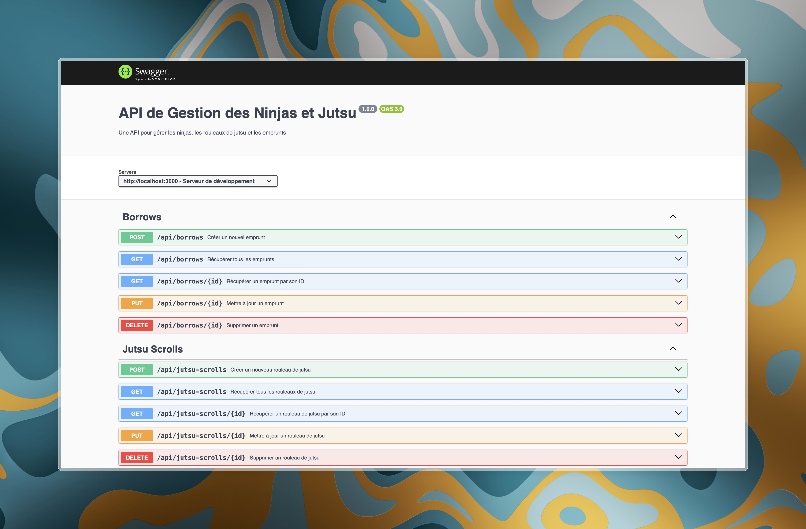

# API de Gestion des Ninjas et Jutsu Scrolls

## Description du Projet

Cette API RESTful a été développée pour gérer un système de bibliothèque de rouleaux de jutsu pour ninjas. Elle permet de :

- Gérer les profils des ninjas
- Cataloguer les rouleaux de jutsu
- Suivre les emprunts et retours des rouleaux

L'API offre des fonctionnalités complètes de CRUD (Create, Read, Update, Delete) pour chaque entité, avec des options avancées de pagination, filtrage et tri.

## Technologies Utilisées

- Node.js
- Express.js
- MongoDB avec Mongoose
- Swagger pour la documentation de l'API
- Jest et Supertest pour les tests unitaires

## Prérequis

- Node.js (v14.0.0 ou supérieur)
- MongoDB

## Installation

1. Clonez le dépôt :

   ```
   git clone https://github.com/RomainRamanzin/ninja_library.git
   ```

2. Installez les dépendances :

   ```
   cd ninja-library
   npm install
   ```

3. Créez un fichier `.env` à la racine du projet et configurez les variables d'environnement :
   ```
   PORT=3000
   MONGODB_URI=mongodb://localhost:27017/ninja_jutsu_db
   JWT_TOKEN=
   ```

## Création du jeu de test

Pour lancer la commande de création de jeu de test :

```
npm run migration
```

## Démarrage du Serveur

Pour lancer le serveur en mode développement :

```
npm run dev
```

Le serveur démarrera par défaut sur `http://localhost:3000`.

## Documentation de l'API

La documentation Swagger de l'API est disponible à l'adresse `http://localhost:3000/api-docs` une fois le serveur lancé.

## Aperçu de l'Application



## Utilisation de l'API

### Exemples de Requêtes

1. Créer un nouveau ninja :

   ```
   POST /api/v1/ninjas
   Content-Type: application/json

   {
     "name": "Naruto Uzumaki",
     "rank": "Genin",
     "clan": "Uzumaki",
     "specialite": "Ninjutsu",
     "jutsus_maitrises": ["Rasengan", "Kage Bunshin no Jutsu"]
   }
   ```

2. Récupérer tous les rouleaux de jutsu (avec pagination et tri) :

   ```
   GET /api/v1/jutsu-scrolls?page=1&limit=10&sortBy=name:asc
   ```

3. Créer un nouvel emprunt :

   ```
   POST /api/v1/borrows
   Content-Type: application/json

   {
     "ninjaId": "5f8d0f3e1c9d440000a1d3e5",
     "jutsuScrollId": "5f8d0f3e1c9d440000a1d3e6",
     "borrowDate": "2023-05-01",
     "returnDueDate": "2023-05-15"
   }
   ```

## Structure du Projet

```
ninja-jutsu-api/
│
├── src/
│   ├── v1/
│   │   ├── routes/
│   │   │   ├── ninja.routes.js
│   │   │   ├── jutsuScroll.routes.js
│   │   │   └── borrow.routes.js
│   │   ├── controllers/
│   │   │   ├── ninja.controller.js
│   │   │   ├── jutsuScroll.controller.js
│   │   │   └── borrow.controller.js
│   │   └── models/
│   │       ├── ninja.model.js
│   │       ├── jutsuScroll.model.js
│   │       └── borrow.model.js
│   │
│   ├── v2/
│   │
│   ├── config/
│   │   ├── db.config.js
│   │   └── db.memory.config.js
│   │
│   └── models/
│       ├── ninja.model.js
│       ├── jutsuScroll.model.js
│       └── borrow.model.js
│
├── .env
├── .gitignore
├── app.js
├── package.json
├── README.md
└── swagger.js
```

## Tests

Pour exécuter les tests unitaires avec `mongodb-memory-server` :

```
npm test
```

## Collaborateurs

Ce projet a été réalisé par :
[Sinan Yazici](https://github.com/sinan-yazici)
et [Romain Ramanzin](https://github.com/RomainRamanzin)

## Contribution

Les contributions sont les bienvenues ! N'hésitez pas à ouvrir une issue ou à soumettre une pull request.

## Licence

Ce projet est sous licence MIT. Voir le fichier `LICENSE` pour plus de détails.
